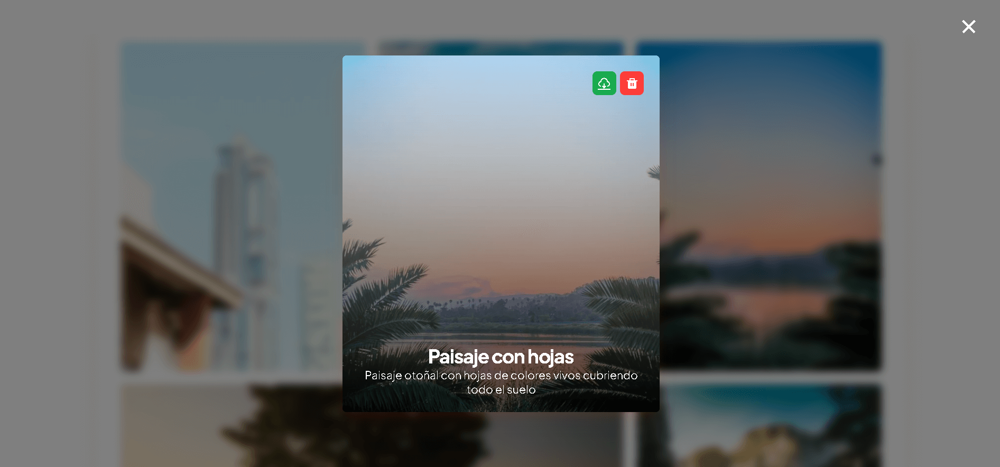

# Gallery Delight

Este proyecto es una galería de imágenes interactiva diseñada para mostrar una lista de imágenes preseleccionadas con diversas funcionalidades. La galería permite a los usuarios navegar y gestionar imágenes de manera eficiente mediante una interfaz intuitiva. Entre las características principales se encuentran la visualización de imágenes en una cuadrícula optimizada, la aplicación de filtros para buscar y seleccionar imágenes específicas, la opción de eliminar y descargar imágenes, y un formulario para crear y publicar nuevas imágenes. Este proyecto tiene como objetivos prácticos y educativos la práctica del uso de display grid y el reforzamiento de conocimientos en JavaScript, mejorando la experiencia del usuario y desarrollando habilidades en HTML, CSS y JavaScript.

## Demo

[Demo](https://gallerydelight.vercel.app)

## Screenshots

## Features

- **Visualización en Cuadrícula:** Las imágenes se muestran en una cuadrícula según sus dimensiones, clasificadas en anchas, altas o grandes.
- **Filtro por Categoría:** Las imágenes pueden ser filtradas según la categoría a la que pertenecen.
- **Información Detallada en Modal:** Al hacer clic en una imagen, se puede visualizar mayor información sobre ella en un modal.
- **Descargar Imágenes:** Las imágenes pueden ser descargadas directamente desde la galería.
- **Eliminar Imágenes:** Los usuarios pueden eliminar imágenes de la galería de manera local.
- **Publicar Nueva Imagen:** Los usuarios pueden publicar una nueva imagen rellenando los campos de nombre, descripción y categoría, y subiendo un archivo desde su computadora.
- **Asignación Automática de Clases:** Al subir una imagen, el sistema consulta sus dimensiones y le asigna una clase específica según su relación de aspecto, utilizando un preset automático.

## Tech Stack

**Frontend:** HTML, CSS y Javascript
